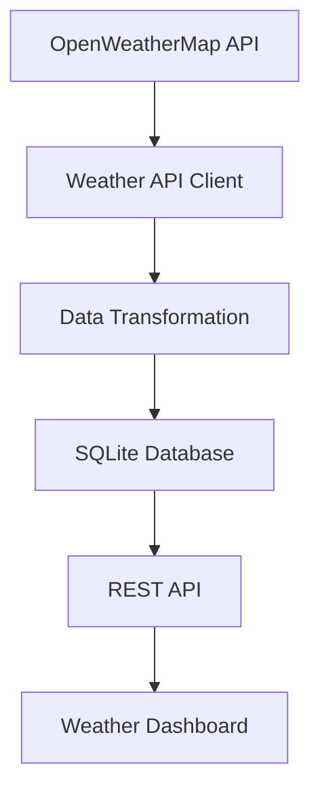

# Weather ETL Pipeline

A robust, scalable weather data pipeline that fetches current weather data from OpenWeatherMap API, processes and stores it in SQLite, and provides visualization capabilities.

## Project Structure

The project is organized as follows:

```
.
├── weather_pipeline/           # Main pipeline implementation
│   ├── src/                   # Source code
│   ├── tests/                 # Unit tests
│   ├── db/                    # SQLite database files
│   ├── logs/                  # Log files
│   ├── docs/                  # Documentation and visualizations
│   ├── scripts/               # Setup and utility scripts
│   ├── docker/                # Docker configuration
│   ├── requirements.txt       # Python dependencies
│   ├── .env.template         # Environment variables template
│   └── README.md             # Detailed pipeline documentation
├── weather-dashboard/         # React frontend dashboard
└── README.md                 # This file
```

## Data Pipeline Overview

The weather ETL pipeline is a Python-based system that automatically collects, processes, and stores weather data from the OpenWeatherMap API. It's designed for reliability, scalability, and ease of deployment.

### Architecture

The pipeline follows a modular architecture with these key components:

1. **Data Extraction Layer** ([src/weather_api.py](file:///Users/dulajupananda/Documents/Projects/Weather-ETL-Pipeline/weather_pipeline/src/weather_api.py))
   - Fetches current weather data from OpenWeatherMap API
   - Handles API authentication and rate limiting
   - Implements retry mechanisms for failed requests

2. **Data Processing Layer** ([src/pipeline.py](file:///Users/dulajupananda/Documents/Projects/Weather-ETL-Pipeline/weather_pipeline/src/pipeline.py))
   - Transforms raw API responses into structured data
   - Validates data quality and handles anomalies
   - Coordinates the ETL workflow

3. **Data Storage Layer** ([src/models.py](file:///Users/dulajupananda/Documents/Projects/Weather-ETL-Pipeline/weather_pipeline/src/models.py))
   - Uses SQLite database with SQLAlchemy ORM
   - Stores historical weather observations
   - Implements efficient querying with indexes

4. **Scheduling Layer** ([src/scheduler.py](file:///Users/dulajupananda/Documents/Projects/Weather-ETL-Pipeline/weather_pipeline/src/scheduler.py))
   - Runs the pipeline at configurable intervals (default: every 5 minutes)
   - Manages continuous operation and error recovery
   - Supports both scheduled and manual execution

5. **API Layer** ([src/api.py](file:///Users/dulajupananda/Documents/Projects/Weather-ETL-Pipeline/weather_pipeline/src/api.py), [dashboard_api.py](file:///Users/dulajupananda/Documents/Projects/Weather-ETL-Pipeline/weather_pipeline/dashboard_api.py))
   - Provides RESTful endpoints for data access
   - Serves data to the frontend dashboard
   - Includes health check and monitoring endpoints

### Data Flow



### Key Features

- **Real-time Data Collection**: Fetches current weather data for configured locations
- **Automatic Scheduling**: Runs every 5 minutes to keep data fresh
- **Data Validation**: Ensures data quality and consistency
- **Error Handling**: Robust retry mechanisms and error logging
- **Historical Storage**: Maintains a growing database of weather observations
- **RESTful API**: Provides easy access to weather data
- **Containerization Ready**: Docker support for easy deployment
- **Monitoring & Logging**: Comprehensive logging for troubleshooting

## Quick Start

1. Navigate to the weather_pipeline directory:
   ```bash
   cd weather_pipeline
   ```

2. Run the setup script:
   ```bash
   ./scripts/setup.sh
   ```

3. Edit the `.env` file to add your OpenWeatherMap API key:
   ```bash
   # Copy the template and edit it
   cp .env.template .env
   # Edit .env with your API key and configurations
   ```

4. Run the pipeline:
   ```bash
   python -m src.main run
   ```

5. Start the API server for the dashboard:
   ```bash
   python dashboard_api.py
   ```

## Pipeline Commands

The pipeline supports several execution modes through the [src/main.py](file:///Users/dulajupananda/Documents/Projects/Weather-ETL-Pipeline/weather_pipeline/src/main.py) entry point:

- **Run Once**: `python -m src.main run` - Fetches data immediately
- **Scheduled Mode**: `python -m src.main schedule` - Runs continuously at configured intervals
- **Health Check**: `python -m src.main health` - Verifies system health

## Configuration

Key configuration options in the `.env` file:

- `OWM_API_KEY`: Your OpenWeatherMap API key
- `LOCATIONS`: Semicolon-separated list of locations to monitor
- `SCHEDULE_INTERVAL_HOURS`: How often to fetch data (default: 0.083 hours / 5 minutes)
- `SQLITE_DB`: Path to the SQLite database file

## Database Schema

The pipeline uses a single table `weather_observations` with these key fields:

- `location`: The location name
- `timestamp_utc`: When the weather was recorded by OpenWeatherMap
- `temp_c`: Temperature in Celsius
- `humidity`: Humidity percentage
- `pressure`: Atmospheric pressure in hPa
- `wind_speed`: Wind speed in m/s
- `weather_main`: Main weather condition (e.g., "Clear", "Rain")
- `fetched_at_utc`: When our pipeline fetched the data
- `raw_json`: Complete raw API response for detailed analysis

## Monitoring

- Logs are written to the `logs/` directory
- Health check endpoint at `/api/health`
- Database records include fetch timestamps for monitoring data freshness

## Deployment

The pipeline can be deployed in several ways:

1. **Locally**: Run directly on any machine with Python
2. **Docker**: Use the provided Dockerfile and docker-compose.yml
3. **Cloud Platforms**: Deploy to services like Render.com, Heroku, or AWS

## Frontend Dashboard

The project includes a React-based dashboard in the `weather-dashboard/` directory that:

- Displays current weather conditions for monitored locations
- Shows temperature, humidity, wind speed, and other metrics
- Automatically refreshes data every minute
- Provides a responsive, mobile-friendly interface

To run the dashboard:
```bash
cd weather-dashboard
npm install
npm start
```

## Documentation

For detailed documentation, see [weather_pipeline/README.md](weather_pipeline/README.md).