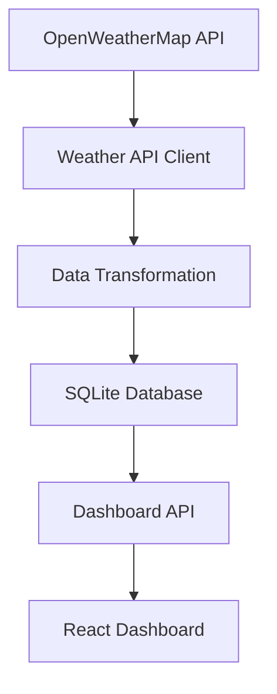

# Weather ETL Pipeline

A robust, scalable weather data pipeline that fetches current weather data from OpenWeatherMap API, processes and stores it in SQLite, and provides visualization capabilities.

## Features

- **Data Extraction**: Fetches current weather data from OpenWeatherMap API
- **Data Transformation**: Cleans and transforms raw weather data
- **Data Loading**: Stores processed data in SQLite database
- **Scheduling**: Runs automatically at configurable intervals (default: every 5 minutes)
- **Monitoring**: Built-in logging and health checks
- **Visualization**: Generates charts and reports
- **Error Handling**: Retry mechanisms and graceful failure handling
- **Scalability**: Modular architecture for easy extension
- **Real-time Dashboard**: Provides data to a React frontend via REST API

## Project Structure

```
weather_pipeline/
├── src/                    # Source code
│   ├── config.py          # Configuration management
│   ├── models.py          # Database models
│   ├── logger.py          # Logging utilities
│   ├── weather_api.py     # Weather API client
│   ├── pipeline.py        # Main ETL pipeline
│   ├── scheduler.py        # Scheduling functionality
│   ├── visualization.py   # Data visualization
│   ├── api.py             # Internal API endpoints
│   └── main.py            # Main entry point
├── tests/                 # Unit tests
├── db/                    # SQLite database files
├── logs/                  # Log files
├── docs/                  # Documentation and visualizations
├── scripts/               # Setup and utility scripts
├── docker/                # Docker configuration
├── requirements.txt       # Python dependencies
├── .env.template         # Environment variables template
├── dashboard_api.py       # Dashboard API server
└── README.md             # This file
```

## Prerequisites

- Python 3.8+
- pip
- OpenWeatherMap API key (sign up at [openweathermap.org](https://openweathermap.org/api))
- SQLite3 (usually comes pre-installed with Python)

## Installation

1. Clone the repository:
   ```bash
   git clone <repository-url>
   cd weather-pipeline
   ```

2. Create a virtual environment:
   ```bash
   python -m venv venv
   source venv/bin/activate  # On Windows: venv\Scripts\activate
   ```

3. Install dependencies:
   ```bash
   pip install -r requirements.txt
   ```

4. Set up environment variables:
   ```bash
   cp .env.template .env
   ```
   Edit `.env` and add your OpenWeatherMap API key and other configurations.

## Configuration

Create a `.env` file based on `.env.template` with the following variables:

```env
# OpenWeather API Configuration
OWM_API_KEY=your_openweather_api_key_here

# Locations to fetch weather data for (semicolon-separated)
# Format: "City,Country" or "lat,lon"
LOCATIONS=Colombo,Sri Lanka;Kandy,Sri Lanka;Anuradhapura,Sri Lanka

# Database Configuration
SQLITE_DB=./db/weather.db

# S3 Configuration (optional)
S3_BUCKET=your-bucket-name
PUSH_TO_S3=false

# Logging Configuration
LOG_LEVEL=INFO
LOG_FILE=./logs/pipeline.log

# Scheduler Configuration
SCHEDULE_INTERVAL_HOURS=0.083

# Retry Configuration
MAX_RETRIES=3
RETRY_DELAY_SECONDS=5

# Data Validation
MIN_TEMP_C=-100
MAX_TEMP_C=100
```

## Usage

### Run Once

To run the pipeline once and fetch the latest data:

```bash
python -m src.main run
```

### Run Continuously (Scheduled)

To run the pipeline continuously with the configured schedule (every 5 minutes):

```bash
python -m src.main schedule
```

### Health Check

To run a health check:

```bash
python -m src.main health
```

### Start Dashboard API Server

To start the API server that serves data to the frontend dashboard:

```bash
python dashboard_api.py
```

### Generate Visualizations

To generate visualizations:

```bash
python -m src.visualization
```

## Database Schema

The pipeline uses a SQLite database with the following schema:

```sql
CREATE TABLE weather_observations (
  id INTEGER PRIMARY KEY AUTOINCREMENT,
  location TEXT NOT NULL,
  lat REAL,
  lon REAL,
  timestamp_utc TEXT NOT NULL,
  temp_c REAL,
  temp_k REAL,
  feels_like_c REAL,
  humidity INTEGER,
  pressure INTEGER,
  wind_speed REAL,
  wind_deg INTEGER,
  weather_main TEXT,
  weather_description TEXT,
  raw_json TEXT,
  fetched_at_utc TEXT NOT NULL
);

CREATE INDEX idx_location_timestamp ON weather_observations(location, timestamp_utc);
CREATE INDEX idx_fetched_at ON weather_observations(fetched_at_utc);
```

Key fields:
- `location`: The location name
- `timestamp_utc`: When the weather was recorded by OpenWeatherMap
- `temp_c`: Temperature in Celsius
- `humidity`: Humidity percentage
- `pressure`: Atmospheric pressure in hPa
- `wind_speed`: Wind speed in m/s
- `weather_main`: Main weather condition (e.g., "Clear", "Rain")
- `fetched_at_utc`: When our pipeline fetched the data
- `raw_json`: Complete raw API response for detailed analysis

## Data Pipeline Workflow



1. **Data Extraction**: The pipeline fetches current weather data for all configured locations from OpenWeatherMap API
2. **Data Transformation**: Raw API responses are parsed and transformed into structured data
3. **Data Loading**: Processed data is stored in the SQLite database with timestamps
4. **Data Serving**: The dashboard API serves the latest data to the frontend
5. **Data Visualization**: The React dashboard displays real-time weather information

## Monitoring

The pipeline includes built-in monitoring capabilities:

- **Logging**: All operations are logged to the configured log file with timestamps
- **Health Checks**: Monitor data freshness and system status via `/api/health` endpoint
- **Error Handling**: Automatic retries with exponential backoff for failed API requests
- **Data Freshness**: Each record includes both weather timestamp and fetch timestamp

To check the status of the pipeline:
```bash
# Check database for latest records
python -c "
import sqlite3
from datetime import datetime
conn = sqlite3.connect('db/weather.db')
cursor = conn.cursor()
cursor.execute('SELECT location, fetched_at_utc FROM weather_observations ORDER BY fetched_at_utc DESC LIMIT 3')
records = cursor.fetchall()
for record in records:
    print(f'{record[0]}: {record[1]}')
conn.close()
"
```

## Testing

Run unit tests with pytest:

```bash
pytest tests/
```

## Extending the Pipeline

The modular architecture makes it easy to extend the pipeline:

1. **Add new data sources**: Implement new API clients in `src/`
2. **Add new transformations**: Extend the transformation logic in `src/weather_api.py`
3. **Add new visualizations**: Add new methods to `src/visualization.py`
4. **Add new storage backends**: Extend the database manager in `src/models.py`
5. **Add new locations**: Update the LOCATIONS variable in `.env`

## Performance Considerations

- **Batch Processing**: The pipeline processes multiple locations in batches
- **Connection Pooling**: Database connections are efficiently managed
- **Memory Management**: Data is processed in chunks to minimize memory usage
- **Caching**: API responses can be cached to reduce load
- **Indexing**: Database indexes on location and timestamps for fast queries

## Troubleshooting

### Common Issues

1. **API Key Error**: Ensure your OpenWeatherMap API key is correctly set in `.env`
2. **Database Permissions**: Ensure the application has write permissions to the database directory
3. **Network Issues**: Check your internet connection and firewall settings
4. **Outdated Data**: If data is not updating, ensure the scheduler is running (`python -m src.main schedule`)

### Logs

Check the log file specified in `LOG_FILE` for detailed error information.

## Deployment Options

The pipeline can be deployed in several ways:

1. **Locally**: Run directly on any machine with Python
2. **Docker**: Use the provided Dockerfile and docker-compose.yml
3. **Cloud Platforms**: Deploy to services like Render.com, Heroku, or AWS

For free deployment options, see the root README.md file.

## Contributing

1. Fork the repository
2. Create a feature branch
3. Make your changes
4. Add tests if applicable
5. Submit a pull request

## License

This project is licensed under the MIT License - see the [LICENSE](LICENSE) file for details.